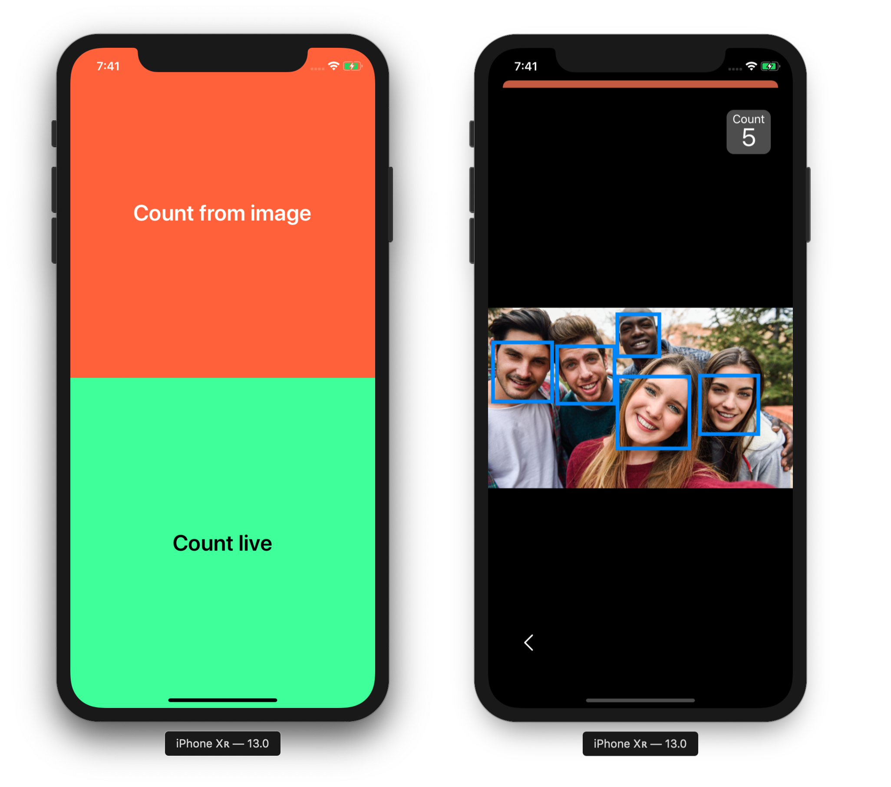

# PeopleCounter



## Overview
This app uses the [Vision API](https://developer.apple.com/documentation/vision
) to detect the amout of face in a picture. The app also includes a live count view which analyses every frame to count the amount of visible faces.

*The app was developed for the Mobile Application Development Minor at the HAN University of Applied Sciences in the Netherlands.*

## Installation
Try this app download or clone the project (on a MacBook) and open the ```PersonCounter.xcodeproj``` in xCode. From there you can run the app in the simulator or on a device.

*Note: The live view wil not work inside the simulator or a device without a camera.*